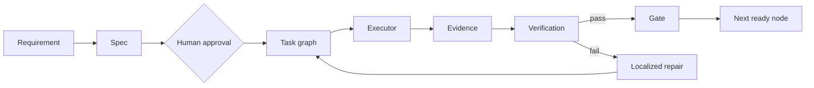

<div align="center">


# Graph Harness SDLC

**Structured autonomy over an executable software delivery graph.**

[English](README.md) · [Español](README.es.md) · [Português](README.pt.md) · [Italiano](README.it.md)

</div>

Graph Harness SDLC is an execution runtime and engineering methodology for autonomous, long-running software development programs.

It converts software delivery from a sequence of isolated prompts into a persistent executable graph composed of typed state, explicit dependencies, quality gates, traceable evidence and localized repair.

**English is the canonical documentation language.** Translations are maintained for accessibility, while normative identifiers, schemas and runtime contracts remain in English.

## Core principle

> The execution graph is the source of truth. Agents are interchangeable executors.

A feature is not complete because code exists. It is complete only when its evidence satisfies every required gate and the graph remains in a valid state.

## What Graph Harness SDLC provides

- Executable development graphs
- Typed execution state
- Dependency-aware scheduling
- Persistent checkpoints
- Producer, critic, fixer and verifier separation
- Deterministic quality gates
- Evidence-backed completion
- Localized repair
- Human approval gates
- Resumable long-session execution
- Explicit terminal states

## Execution lifecycle

```text
Ready Node
    ↓
Producer
    ↓
Critic / Red Team
    ↓
Fixer
    ↓
Independent Verifier
    ↓
Release Gate
    ↓
Persistent Evidence
    ↓
Next Ready Node
```

The graph governs readiness, permissions, dependencies, evidence freshness and closure. Executors may change between nodes or retries without changing the source of truth.

## Objective

The objective is not to generate activity.

**The objective is to finish the product.**

Execution continues until the repository reaches one of three program terminal states:

- `COMPLETED`
- `PARTIAL_WITH_DOCUMENTED_BLOCKERS`
- `SAFETY_STOP`

These are program-level outcomes. They are distinct from node lifecycle statuses such as `done`, `blocked` and `repair_required`. See [Terminal states](docs/terminal-states.md).

## Runtime model

A consuming repository supplies:

- a versioned `graph-harness.project.v1` graph definition;
- an append-only `graph-harness.event.v1` event ledger;
- domain adapters that pin a specific revision of this repository.

The runtime derives `graph-harness.state.v1` from those sources and enforces valid transitions, evidence freshness, dependency readiness, gates, checkpoints and localized repair.



```text
Task node -> Capability -> Scheduler -> Executor -> Evidence -> Gate
```

The runtime does not grant authority to merge, release, deploy, spend funds, mutate secrets or create external effects. Those decisions remain explicit human or repository-owned gates.

## Quick start

```sh
./init.sh
```

Validate and inspect a consuming graph:

```sh
python3 -m graph_harness \
  --project graph-harness.project.json \
  --events graph-harness.events.jsonl \
  validate

python3 -m graph_harness \
  --project graph-harness.project.json \
  --events graph-harness.events.jsonl \
  status --pretty
```

## Documentation

- [Documentation index](docs/README.md)
- [Concepts](docs/concepts.md)
- [Runtime architecture](docs/runtime-architecture.md)
- [System architecture](docs/system-architecture.md)
- [Tutorials](docs/tutorials.md)
- [Examples](examples/)
- [Reference](docs/reference.md)

## Repository structure

```text
Graph-harness-sdlc/
  AGENTS.md
  RTK.md
  CLAUDE.md
  feature_list.json
  graph_harness/
  schemas/
  specs/
  templates/
  skills/
  docs/
  examples/
  progress/
```

## Design position

Graph Harness SDLC is not an application and not a prompt collection. It is the reusable execution operating system used by application repositories to deliver software through a governed graph.

```text
Intent -> Spec -> Executable graph -> Executors -> Evidence -> Gates -> Persistent state
```

Every framework change should strengthen reusable delivery semantics rather than introduce product-specific assumptions.
