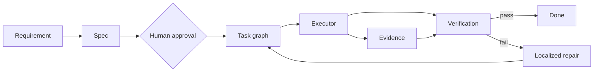

<div align="center">


# Graph Harness SDLC

**Structured autonomy over an executable graph, with typed state, traceable evidence, and localized repair.**

[Español](docs/i18n/README.es.md) · [Português](docs/i18n/README.pt.md) · [Italiano](docs/i18n/README.it.md)

</div>

> English is the canonical documentation language. Community translations may lag behind the canonical version.

`Graph Harness SDLC` is a reusable execution runtime and engineering methodology for building software with AI agents without depending on a monolithic conversation or context-losing loops. It turns requirements, tasks, decisions, verification results, and failures into explicit nodes and relationships that can be executed, audited, resumed, and repaired.

The objective is not to generate activity. The objective is to finish the product.

## Core model



The agent is not the center of the architecture. It is an interchangeable executor operating inside a graph governed by dependencies, capabilities, permissions, and gates.

```text
Task node -> Capability -> Scheduler -> Executor -> Evidence -> Gate
```

## Executable runtime

The framework includes an application-independent Python runtime. A consuming repository provides:

- a `graph-harness.project.v1` generated from its canonical sources;
- an append-only `graph-harness.event.v1` ledger;
- domain adapters that reference a pinned revision of this repository.

```sh
python3 -m graph_harness \
  --project graph-harness.project.json \
  --events graph-harness.events.jsonl \
  validate

python3 -m graph_harness \
  --project graph-harness.project.json \
  --events graph-harness.events.jsonl \
  status --pretty
```

The event store verifies contiguous sequence, project identity, node revision, and a SHA-256 chain. Localized repair preserves historical evidence, increments the affected node revision, and invalidates only the source node and its descendants.

The runtime does not grant authority to merge, release, deploy, spend money, access secrets, or produce external effects. Those decisions remain human and repository-specific gates.

## What it provides

- Spec-Driven Development
- Harness Engineering
- Loop Engineering
- Typed execution graphs
- Typed execution state
- Dependency-aware scheduling
- Separation of roles and capabilities
- Human approval gates
- File and permission boundaries
- Verifiable evidence
- Deterministic quality gates by operating mode
- Persistent checkpoints and recovery
- Localized repair of the affected subgraph
- Traceable decisions and technical debt
- Resumable long-session execution
- Explicit terminal states

## Execution lifecycle

```text
Ready node
    -> Producer
    -> Critic / Red Team
    -> Fixer
    -> Independent Verifier
    -> Release Gate
    -> Persistent Evidence
    -> Next Ready Node
```

A feature is not complete because code exists. It is complete only when its evidence satisfies every required gate and the graph remains in a valid state.

## States

```text
pending -> spec_ready -> approved -> ready -> running -> review -> done
                                  \-> blocked
                                  \-> repair_required
```

## Operating modes

**MVP** keeps scope constrained while preserving tests, verification, review, and lightweight gates.

**SHIP** adds security, data integrity, performance, failure modes, accessibility, observability, and operational readiness.

## Completion semantics

Execution continues until the repository reaches one of these terminal states:

- `COMPLETED` — no useful, safe, unlocked, and verifiable engineering work remains.
- `PARTIAL_WITH_DOCUMENTED_BLOCKERS` — all remaining work depends exclusively on documented external blockers, human approval, unavailable infrastructure, unavailable credentials, or explicit product decisions.
- `SAFETY_STOP` — continuing would violate safety, security, integrity, or human-gated constraints.

Do not stop after analysis, planning, scaffolding, one feature, one issue, one commit, one pull request, or one milestone. Continue selecting the highest-priority `READY` node until a valid terminal state is reached.

## Repository structure

```text
Graph-harness-sdlc/
  AGENTS.md
  RTK.md
  CLAUDE.md
  feature_list.json
  .opencode/commands/
  .claude/agents/
  skills/
  specs/
  templates/
  docs/
    i18n/
  adr/
  examples/
  progress/
```

## Initial workflow

```sh
./init.sh
```

1. Define or select a feature.
2. Produce requirements, design, and tasks.
3. Obtain human approval where required.
4. Execute only ready nodes.
5. Attach evidence to every result.
6. Evaluate the applicable gates.
7. Repair only the affected subgraph.
8. Continue until the product reaches a valid terminal state.

## Guiding principle

No more prompts that attempt to contain process, memory, governance, and state at the same time.

```text
Prompt -> Runtime -> Execution graph -> Executors -> Evidence -> Gates -> Persistent state
```

A compact foundation for delivering real software with controlled autonomy, complete traceability, and precise recovery.