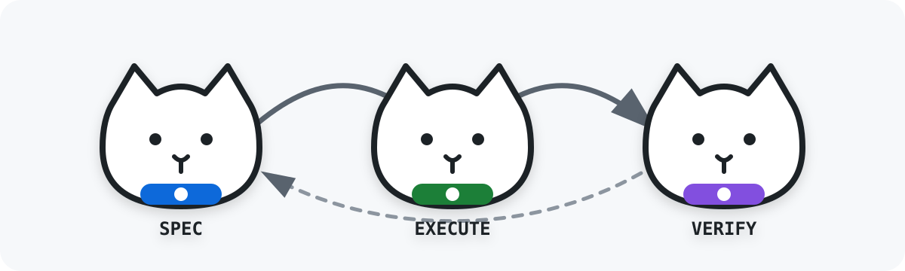
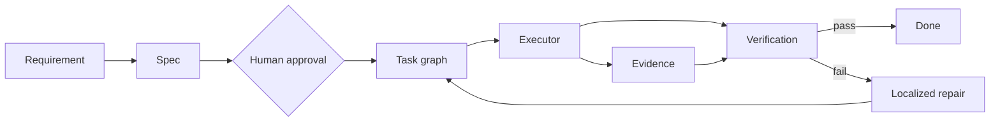

<div align="center">



# Graph Harness SDLC

**Autonomía estructurada sobre un grafo ejecutable, con estado tipado, evidencia trazable y reparación localizada.**

</div>

`Graph Harness SDLC` es un sistema reutilizable para construir software con agentes de IA sin depender de una conversación monolítica ni de ciclos que pierden contexto. Convierte requisitos, tareas, decisiones, verificaciones y fallos en nodos y relaciones explícitas que pueden ejecutarse, auditarse y repararse.

## Modelo



El agente no es el centro de la arquitectura. Es un ejecutor intercambiable dentro de un grafo gobernado por dependencias, capacidades, permisos y gates.

```text
Task node -> Capability -> Scheduler -> Executor -> Evidence -> Gate
```

## Runtime ejecutable

El framework incluye un runtime Python sin dependencias de aplicación. Un repositorio consumidor aporta:

- un `graph-harness.project.v1` generado desde sus fuentes canónicas;
- un ledger append-only `graph-harness.event.v1`;
- adaptadores de dominio que referencian una revisión fijada de este repositorio.

```sh
python3 -m graph_harness \
  --project graph-harness.project.json \
  --events graph-harness.events.jsonl \
  validate

python3 -m graph_harness \
  --project graph-harness.project.json \
  --events graph-harness.events.jsonl \
  status --pretty
```

El event store verifica secuencia contigua, identidad de proyecto, revisión de nodo y una cadena SHA-256. La reparación localizada conserva evidencia histórica, incrementa la revisión del nodo afectado e invalida sólo el nodo fuente y sus descendientes.

El runtime no concede autoridad de merge, release, deployment, gasto, secretos ni efectos externos. Esas decisiones siguen siendo gates humanos y del repositorio consumidor.

## Qué incorpora

- Spec-Driven Development
- Harness Engineering
- Loop Engineering
- grafos de ejecución tipados
- separación de roles y capacidades
- aprobación humana
- límites de archivos y permisos
- evidencia verificable
- quality gates por modo
- checkpoints y recuperación
- reparación localizada del subgrafo afectado
- decisiones y deuda técnica trazables

## Estados

```text
pending -> spec_ready -> approved -> ready -> running -> review -> done
                                  \-> blocked
                                  \-> repair_required
```

## Modos

**MVP** mantiene alcance acotado, pruebas, verificación y revisión con gates ligeros.

**SHIP** añade seguridad, integridad de datos, rendimiento, failure modes, accesibilidad, observabilidad y preparación operativa.

## Estructura

```text
Graph-harness-sdlc/
  AGENTS.md
  RTK.md
  CLAUDE.md
  feature_list.json
  .opencode/commands/
  .claude/agents/
  skills/
  specs/
  templates/
  docs/
  adr/
  examples/
  progress/
```

## Flujo inicial

```sh
./init.sh
```

1. Define o selecciona una feature.
2. Produce requisitos, diseño y tareas.
3. Obtén aprobación humana.
4. Ejecuta únicamente nodos listos.
5. Adjunta evidencia a cada resultado.
6. Evalúa gates.
7. Repara solo el subgrafo afectado.
8. Cierra cuando los criterios estén demostrados.

## Principio rector

No más prompts que intentan contener proceso, memoria, gobierno y estado al mismo tiempo.

```text
Prompt -> Runtime -> Execution graph -> Executors -> Evidence -> Gates -> Persistent state
```

Una base compacta para entregar software real con autonomía controlada, trazabilidad completa y recuperación precisa.
