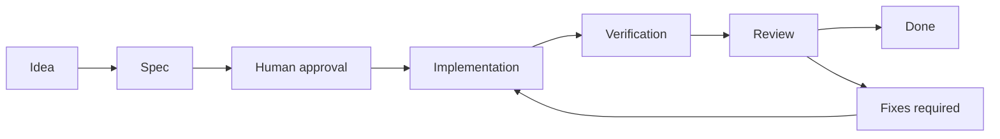
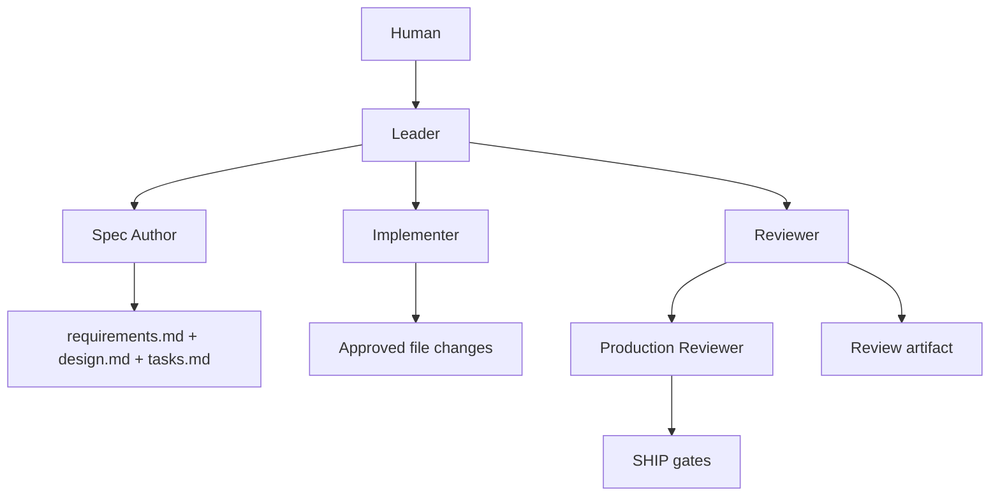

# harness-sdlc

Spec-driven agentic delivery for shippable software.

`harness-sdlc` is a reusable development harness for building applications with AI agents without letting the agent drift, overbuild, or silently change scope.

It combines:

- Spec-Driven Development
- Loop Engineering
- agent role separation
- OpenCode command contracts
- Context7 documentation checkpoints
- human approval gates
- file-bound execution
- automated verification
- production-readiness criteria
- review artifacts
- documented technical debt

The goal is not to generate throwaway prototypes.

The goal is to ship product increments through controlled agentic workflows.

## Visual Model





## Harness Cat

```text
 |\__/,|   (`\
 |_ _  |.--.) )
 ( T   )     /
 /[=H=]\    /
(((^_(((/(((_/

             harness-sdlc
Spec first. Build second. Ship clean.

[SPEC]---[APPROVE]---[BUILD]---[VERIFY]---[REVIEW]---[SHIP]

leash   : file boundaries
collar  : human approval gates
harness : mode-specific gates
```

## Modes

### MVP Mode

For fast, validated prototypes.

MVP Mode still requires specs, bounded scope, tests, and review, but keeps production gates lightweight.

### SHIP Mode

For shippable product increments.

SHIP Mode requires production-grade engineering standards before a feature can be closed, including security, data correctness, performance, failure modes, accessibility, observability readiness, tests, and operational constraints.

## Core Lifecycle

```text
pending -> spec_ready -> approved -> in_progress -> review -> done
```

Additional stop state:

```text
blocked
```

## Gate Stack

```text
MVP  : spec + bounded scope + tests + verification + review
SHIP : MVP + security + data correctness + performance + failure modes
       + accessibility + observability readiness + operations
```

## Repository Structure

```text
harness-sdlc/
  AGENTS.md
  RTK.md
  CLAUDE.md
  README.md
  feature_list.json
  init.sh
  .opencode/commands/
  .claude/agents/
  docs/
  templates/
  progress/
  specs/
```

## First Workflow

The initial feature is `001-harness-bootstrap`.

Current state:

- Feature 1 is specified.
- Feature 1 is set to `spec_ready`.
- Implementation has not started.
- Human approval is required before moving to `approved`.

Run:

```sh
./init.sh
```

## Philosophy

AI agents should not be treated as chatbots that randomly edit your repo.

They should operate inside a harness.

The harness defines the context, tools, memory, permissions, workflow, verification gates, and review process that allow agents to contribute to real software delivery.

One repo. Two modes. Shippable software.
